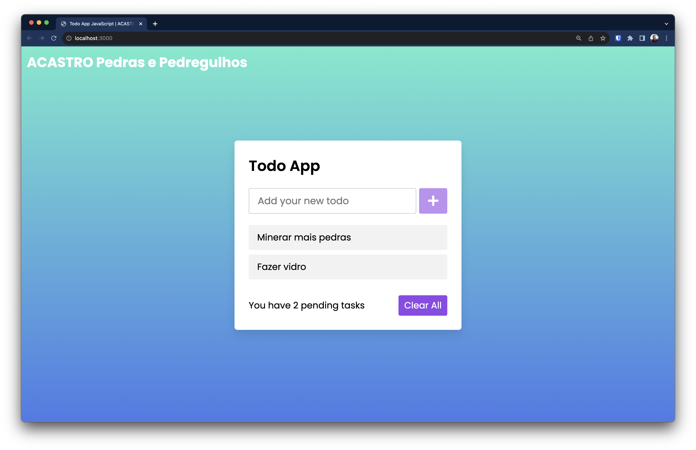

# ACASTRO Pedras e Pedregulhos — Todo List

Aplicativo de lista de tarefas da empresa **ACASTRO Pedras e Pedregulhos**.



---

## Pré-requisitos

- **Node.js 24+** — [download](https://nodejs.org/pt-br/download/)

---

## Instalação

```bash
npm install
```

---

## Desenvolvimento

```bash
npm start
```

Abre o servidor em **http://localhost:3000** com live reload — qualquer alteração nos arquivos recarrega o navegador automaticamente.

---

## Testes

```bash
npm test               # testes unitários (QUnit)
npm run feature-tests  # testes de comportamento (Cucumber)
```

---

## Build de produção

```bash
npm run build
```

Gera a pasta `dist/` com os arquivos otimizados e prontos para servir em qualquer servidor HTTP estático.

Para verificar o build localmente antes de publicar:

```bash
npm run preview   # serve dist/ em http://localhost:4173
```

---

## Deploy

A pasta `dist/` pode ser servida por qualquer servidor HTTP estático. Este repositório inclui um `nginx.conf` pronto para uso.

### Com nginx (Ubuntu/Debian)

```bash
# 1. Instalar o nginx
sudo apt update && sudo apt install -y nginx

# 2. Copiar os arquivos do build para o document root
sudo cp -r dist/* /var/www/html/

# 3. Substituir a configuração padrão pelo nginx.conf deste repositório
sudo cp nginx.conf /etc/nginx/nginx.conf

# 4. Verificar se a configuração está correta
sudo nginx -t

# 5. Recarregar o nginx
sudo systemctl reload nginx
```

A aplicação estará disponível em **http://&lt;ip-do-servidor&gt;**.
